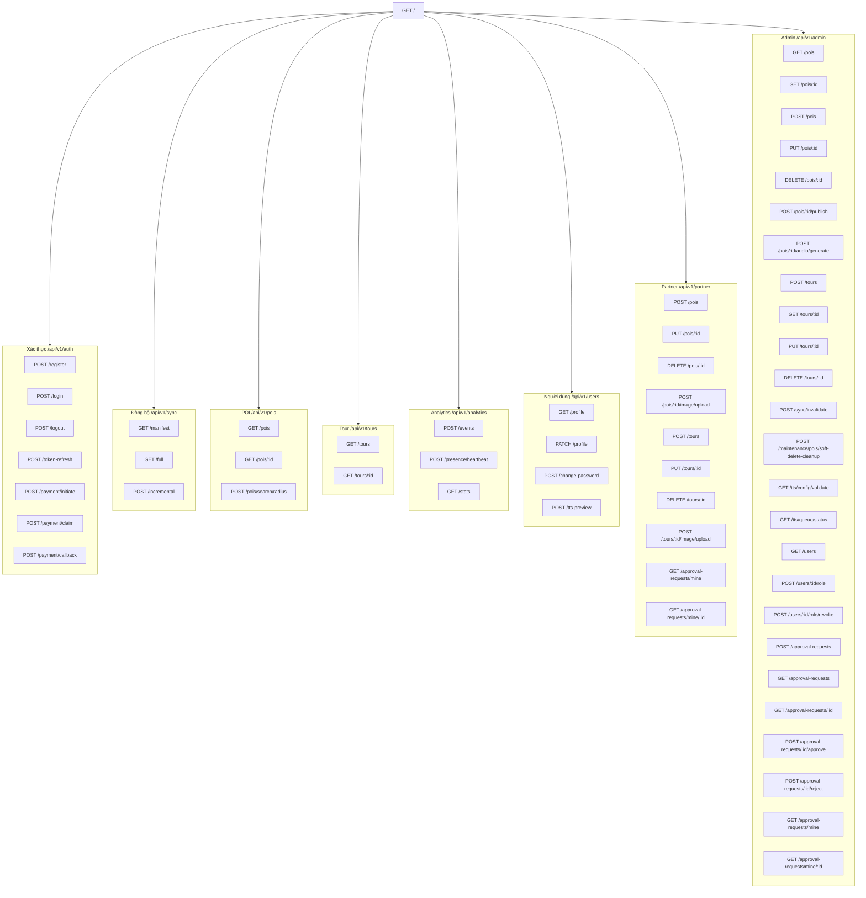

# Endpoints Diagram (từ Postman collection)

Source: `PhoAmThuc_Postman_Collection.json`

```mermaid
flowchart TB
    ROOT[GET /]

    subgraph AUTH["Xác thực /api/v1/auth"]
        A1[POST /register]
        A2[POST /login]
        A3[POST /logout]
        A4[POST /token-refresh]
        A5[POST /payment/initiate]
        A6[POST /payment/claim]
        A7[POST /payment/callback]
    end

    subgraph SYNC["Đồng bộ /api/v1/sync"]
        S1[GET /manifest]
        S2[GET /full]
        S3[POST /incremental]
    end

    subgraph POIS["POI /api/v1/pois"]
        P1[GET /pois]
        P2[GET /pois/:id]
        P3[POST /pois/search/radius]
    end

    subgraph TOURS["Tour /api/v1/tours"]
        T1[GET /tours]
        T2[GET /tours/:id]
    end

    subgraph ANALYTICS["Analytics /api/v1/analytics"]
        AN1[POST /events]
        AN2[POST /presence/heartbeat]
        AN3[GET /stats]
    end

    subgraph USERS["Người dùng /api/v1/users"]
        U1[GET /profile]
        U2[PATCH /profile]
        U3[POST /change-password]
        U4[POST /tts-preview]
    end

    subgraph PARTNER["Partner /api/v1/partner"]
        PA1[POST /pois]
        PA2[PUT /pois/:id]
        PA3[DELETE /pois/:id]
        PA4[POST /pois/:id/image/upload]
        PA5[POST /tours]
        PA6[PUT /tours/:id]
        PA7[DELETE /tours/:id]
        PA8[POST /tours/:id/image/upload]
        PA9[GET /approval-requests/mine]
        PA10[GET /approval-requests/mine/:id]
    end

    subgraph ADMIN["Admin /api/v1/admin"]
        AD1[GET /pois]
        AD2[GET /pois/:id]
        AD3[POST /pois]
        AD4[PUT /pois/:id]
        AD5[DELETE /pois/:id]
        AD6[POST /pois/:id/publish]
        AD7[POST /pois/:id/audio/generate]

        AD8[POST /tours]
        AD9[GET /tours/:id]
        AD10[PUT /tours/:id]
        AD11[DELETE /tours/:id]

        AD12[POST /sync/invalidate]
        AD13[POST /maintenance/pois/soft-delete-cleanup]

        AD14[GET /tts/config/validate]
        AD15[GET /tts/queue/status]

        AD16[GET /users]
        AD17[POST /users/:id/role]
        AD18[POST /users/:id/role/revoke]

        AD19[POST /approval-requests]
        AD20[GET /approval-requests]
        AD21[GET /approval-requests/:id]
        AD22[POST /approval-requests/:id/approve]
        AD23[POST /approval-requests/:id/reject]
        AD24[GET /approval-requests/mine]
        AD25[GET /approval-requests/mine/:id]
    end

    ROOT --> AUTH
    ROOT --> SYNC
    ROOT --> POIS
    ROOT --> TOURS
    ROOT --> ANALYTICS
    ROOT --> USERS
    ROOT --> PARTNER
    ROOT --> ADMIN
```
