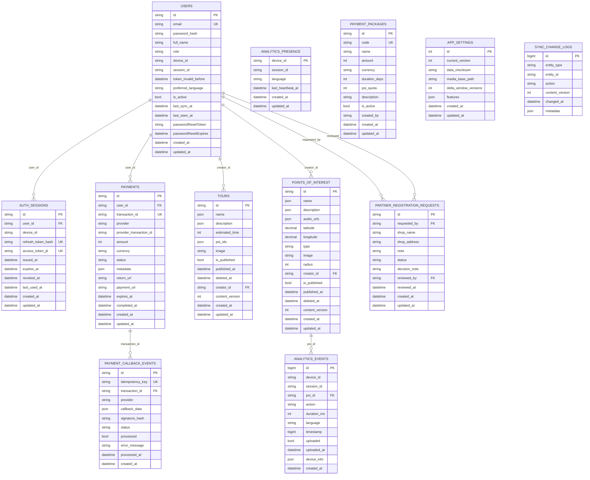

# ERD

Source: apps/backend/prisma/schema.prisma

```mermaid
erDiagram
    USERS {
        string id PK
        string email UK
        string password_hash
        string full_name
        string role
        string device_id
        string session_id
        datetime token_invalid_before
        string preferred_language
        bool is_active
        datetime last_sync_at
        datetime last_seen_at
        string passwordResetToken
        datetime passwordResetExpires
        datetime created_at
        datetime updated_at
    }

    AUTH_SESSIONS {
        string id PK
        string user_id FK
        string device_id
        string refresh_token_hash UK
        string access_token_jti UK
        datetime issued_at
        datetime expires_at
        datetime revoked_at
        datetime last_used_at
        datetime created_at
        datetime updated_at
    }

    POINTS_OF_INTEREST {
        string id PK
        json name
        json description
        json audio_urls
        decimal latitude
        decimal longitude
        string type
        string image
        int radius
        string creator_id FK
        bool is_published
        datetime published_at
        datetime deleted_at
        int content_version
        datetime created_at
        datetime updated_at
    }

    TOURS {
        string id PK
        json name
        json description
        int estimated_time
        json poi_ids
        string image
        bool is_published
        datetime published_at
        datetime deleted_at
        string creator_id FK
        int content_version
        datetime created_at
        datetime updated_at
    }

    ANALYTICS_EVENTS {
        bigint id PK
        string device_id
        string session_id
        string poi_id FK
        string action
        int duration_ms
        string language
        bigint timestamp
        bool uploaded
        datetime uploaded_at
        json device_info
        datetime created_at
    }

    ANALYTICS_PRESENCE {
        string device_id PK
        string session_id
        string language
        datetime last_heartbeat_at
        datetime created_at
        datetime updated_at
    }

    PAYMENTS {
        string id PK
        string user_id FK
        string transaction_id UK
        string provider
        string provider_transaction_id
        int amount
        string currency
        string status
        json metadata
        string return_url
        string payment_url
        datetime expires_at
        datetime completed_at
        datetime created_at
        datetime updated_at
    }

    PAYMENT_PACKAGES {
        string id PK
        string code UK
        string name
        int amount
        string currency
        int duration_days
        int poi_quota
        string description
        bool is_active
        string created_by
        datetime created_at
        datetime updated_at
    }

    PAYMENT_CALLBACK_EVENTS {
        string id PK
        string idempotency_key UK
        string transaction_id FK
        string provider
        json callback_data
        string signature_hash
        string status
        bool processed
        string error_message
        datetime processed_at
        datetime created_at
    }

    PARTNER_REGISTRATION_REQUESTS {
        string id PK
        string requested_by FK
        string shop_name
        string shop_address
        string note
        string status
        string decision_note
        string reviewed_by FK
        datetime reviewed_at
        datetime created_at
        datetime updated_at
    }

    APP_SETTINGS {
        int id PK
        int current_version
        string data_checksum
        string media_base_path
        int delta_window_versions
        json features
        datetime created_at
        datetime updated_at
    }

    SYNC_CHANGE_LOGS {
        bigint id PK
        string entity_type
        string entity_id
        string action
        int content_version
        datetime changed_at
        json metadata
    }

    USERS ||--o{ AUTH_SESSIONS : "user_id"
    USERS ||--o{ PAYMENTS : "user_id"
    USERS ||--o{ POINTS_OF_INTEREST : "creator_id"
    USERS ||--o{ TOURS : "creator_id"
    USERS ||--o{ PARTNER_REGISTRATION_REQUESTS : "requested_by"
    USERS ||--o{ PARTNER_REGISTRATION_REQUESTS : "reviewed_by"

    POINTS_OF_INTEREST ||--o{ ANALYTICS_EVENTS : "poi_id"
    PAYMENTS ||--o{ PAYMENT_CALLBACK_EVENTS : "transaction_id"
```
