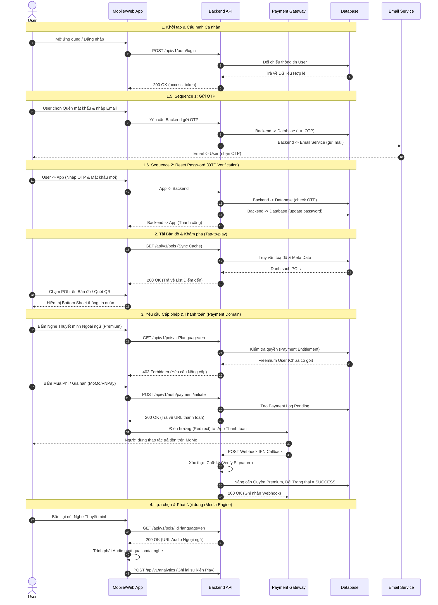
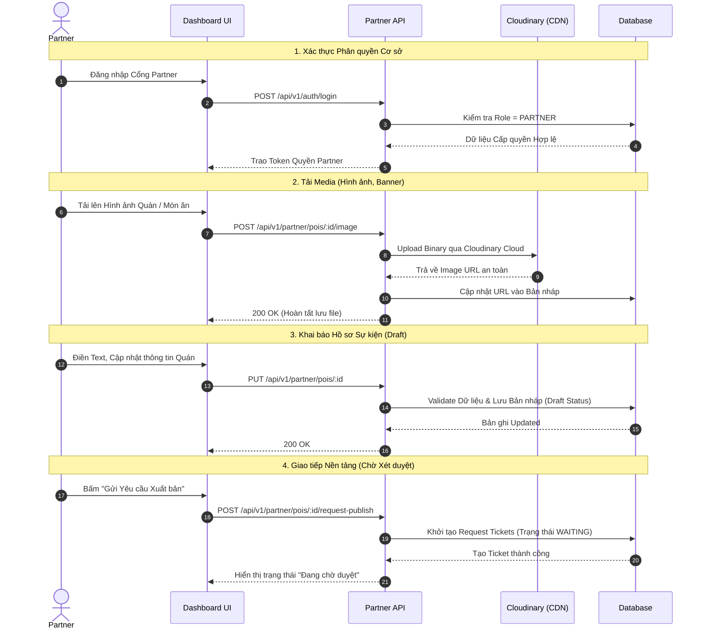
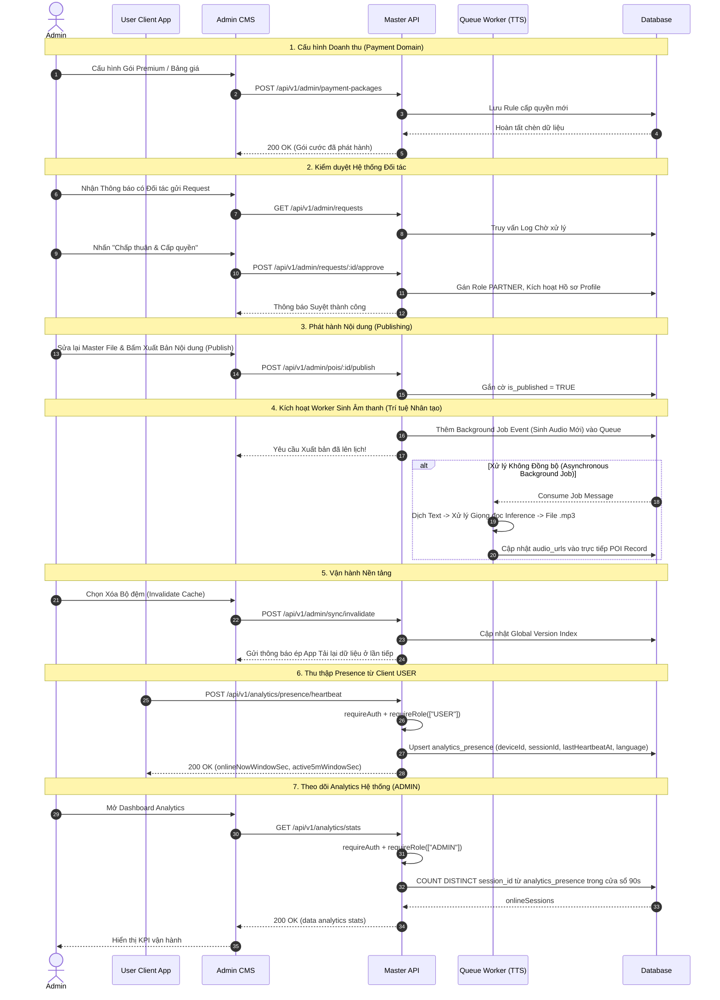

# Sequence Diagram

Source: `auth.ts`, `pois.ts`, `tours.ts`, `sync.ts`, `partner.ts`, `admin.ts`, `poiAdminService.ts`, `ttsService.ts`, `analytics.ts`, `users.ts`, `paymentVerifier.ts`, `paymentPackageService.ts`

## USER (Khách hàng / Foodie)

## PARTNER (Đối tác / Chủ quán)

## ADMIN (Quản trị viên)

