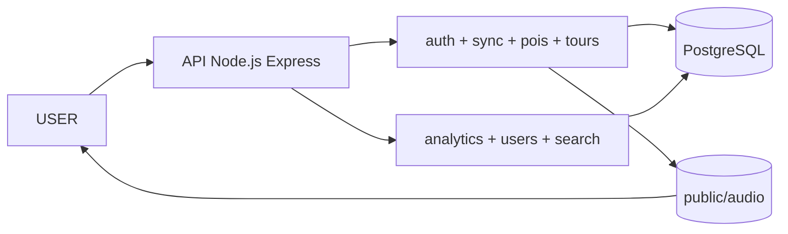
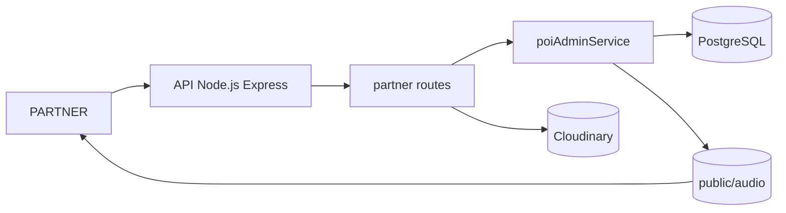
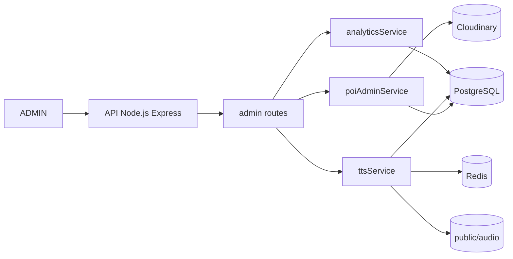

# System Architecture Flow

Source: `apps/backend/src/index.ts`, route files, service files

## USER

```mermaid
flowchart LR
    U[USER] --> API[API Node.js Express]
    API --> S1[auth + sync + pois + tours]
    API --> S2[analytics + users + search]
    S1 --> DB[(PostgreSQL)]
    S2 --> DB
    S1 --> FS[(public/audio)]
    FS --> U
```

## PARTNER

```mermaid
flowchart LR
    P[PARTNER] --> API[API Node.js Express]
    API --> A1[partner routes]
    A1 --> PA[poiAdminService]
    A1 --> IMG[(Cloudinary)]
    PA --> DB[(PostgreSQL)]
    PA --> FS[(public/audio)]
    FS --> P
```

## ADMIN

```mermaid
flowchart LR
    A[ADMIN] --> API[API Node.js Express]
    API --> A2[admin routes]
    A2 --> S4[poiAdminService]
    A2 --> S5[ttsService]
    A2 --> S6[analyticsService]
    S4 --> DB[(PostgreSQL)]
    S5 --> DB
    S6 --> DB
    S5 --> REDIS[(Redis)]
    S5 --> FS[(public/audio)]
    S4 --> IMG[(Cloudinary)]
```
