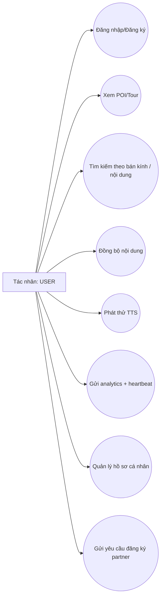
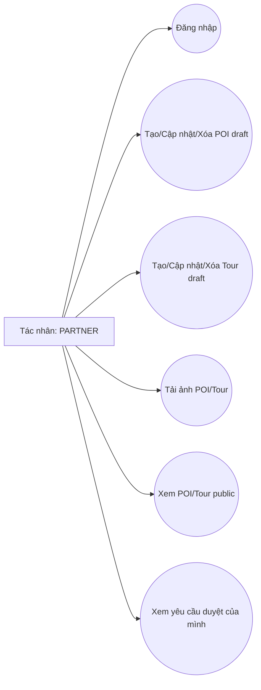
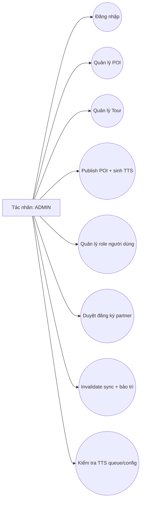

# Use-case Diagram

Source: `apps/backend/src/routes/api/*.ts`

## USER

```mermaid
flowchart LR
    USER[Tác nhân: USER]

    UC1((Đăng nhập/Đăng ký))
    UC2((Xem POI/Tour))
    UC3((Tìm kiếm theo bán kính / nội dung))
    UC4((Đồng bộ nội dung))
    UC5((Phát thử TTS))
    UC6((Gửi analytics + heartbeat))
    UC7((Quản lý hồ sơ cá nhân))
    UC8((Gửi yêu cầu đăng ký partner))

    USER --> UC1
    USER --> UC2
    USER --> UC3
    USER --> UC4
    USER --> UC5
    USER --> UC6
    USER --> UC7
    USER --> UC8
```

## PARTNER

```mermaid
flowchart LR
    PARTNER[Tác nhân: PARTNER]

    UC1((Đăng nhập))
    UC2((Tạo/Cập nhật/Xóa POI draft))
    UC3((Tạo/Cập nhật/Xóa Tour draft))
    UC4((Tải ảnh POI/Tour))
    UC5((Xem POI/Tour public))
    UC6((Xem yêu cầu duyệt của mình))

    PARTNER --> UC1
    PARTNER --> UC2
    PARTNER --> UC3
    PARTNER --> UC4
    PARTNER --> UC5
    PARTNER --> UC6
```

## ADMIN

```mermaid
flowchart LR
    ADMIN[Tác nhân: ADMIN]

    UC1((Đăng nhập))
    UC2((Quản lý POI))
    UC3((Quản lý Tour))
    UC4((Publish POI + sinh TTS))
    UC5((Quản lý role người dùng))
    UC6((Duyệt đăng ký partner))
    UC7((Invalidate sync + bảo trì))
    UC8((Kiểm tra TTS queue/config))

    ADMIN --> UC1
    ADMIN --> UC2
    ADMIN --> UC3
    ADMIN --> UC4
    ADMIN --> UC5
    ADMIN --> UC6
    ADMIN --> UC7
    ADMIN --> UC8
```
